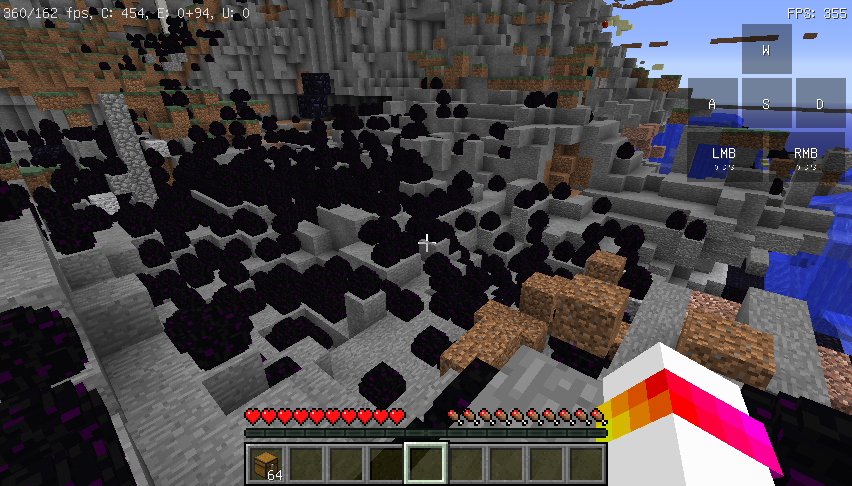
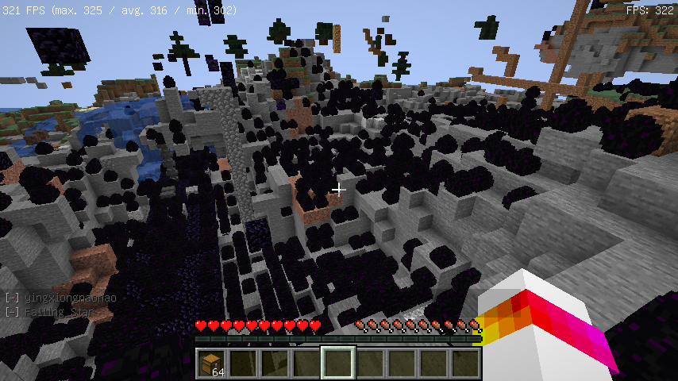

# EraLite
<h5>A Minecraft Optimization Modpack</h2>

EraLite is a Minecraft modpack that optimizes the fps and performace. This modpack adapts for player to play in the multiplayer mode. It means you can use EraLite playing in all kinds of Minecraft servers.

The current version is 1.18.1

the test FPS: 300 - 1000+

## Downloads

In curseforge/github

## Preview

